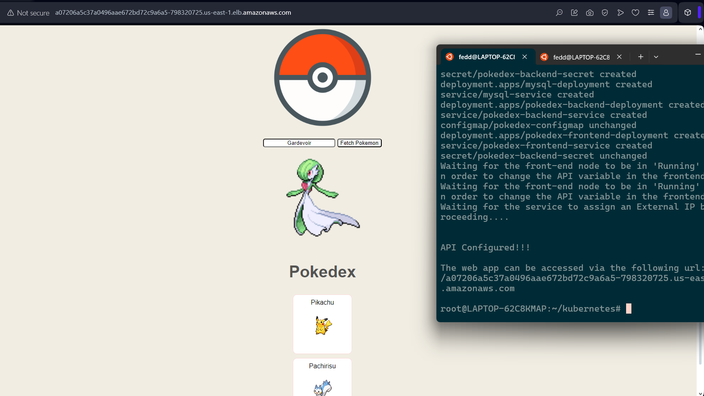

# Web App Cluster

  

### Prerequisites

**AWS Credentials:** Ensure AWS credentials are configured on your device.

**eksctl:** installed for managing EKS clusters.

**kubectl:** installed for interacting with the K8S cluster.

  

## Project Objectives

**1. Develop a Web Application:** Create a simple web app with a backend component.

**2. Containerization:** Dockerize the application using Docker Compose.

**3. Kubernetes Deployment:** Run the containerized app on a Kubernetes (K8S) cluster.

**4. AWS Deployment:** Deploy the app on AWS using Elastic Kubernetes Service (EKS).

**5. Automation:** Automate the cluster provisioning and deployment process using a bash script or Terraform.

  

## Description

This project demonstrates the creation, containerization, and deployment of a simple web application on a Kubernetes cluster. The application includes both frontend and backend components, all managed through Kubernetes on AWS EKS.

  

A custom bash script is included to provision the process of setting up the EKS cluster and deploying the application's components using eksctl and kubectl.

  

## Directory Structure

  

 - client: Contains the frontend code of the web app.
 - server: Contains the backend code of the web app.

  

## Purpose

  

This project was primarily developed to play around with Docker and Kubernetes technologies.

## Web Application Running

## EKS Cluster Provisioning
